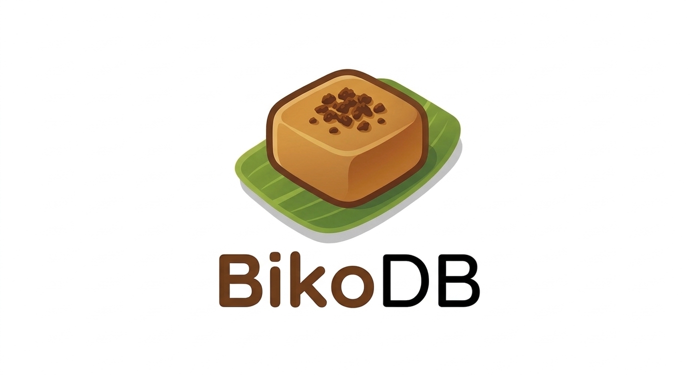

<p align="center">
  
</p>

<p align="center">
  <strong>High-Performance Multi-Model Knowledge Graph Engine</strong><br>
  <em>Graph + Document + Vector — powered by Rust</em>
</p>

<p align="center">
  
  
  
  
  
</p>

---

## Why BikoDB?

BikoDB is a **multi-model database engine** written in Rust that unifies graphs, documents, and vectors in a single embeddable runtime. Zero garbage collection, compile-time memory safety, and a modular crate architecture designed to outperform Java and C++ alternatives on real graph workloads.

| | BikoDB | Neo4j | ArcadeDB | Kuzu |
|---|:---:|:---:|:---:|:---:|
| **Feature Coverage** | **29/29** (100%) | 12/29 (41%) | 20/29 (69%) | 17/29 (59%) |
| **Graph Algorithms (core)** | **11/11** | 4/11 | 7/11 | 7/11 |
| **GC Pauses** | None | ~50ms p99 | ~50ms p99 | None |
| **Binary Size** | ~10 MB | ~150 MB | ~200 MB | ~50 MB |
| **Startup Time** | <10 ms | ~3 s | ~2 s | <100 ms |
| **Query Languages** | SQL + Cypher + Gremlin | Cypher | SQL + Cypher + Gremlin + GraphQL + MQL | Cypher |
| **Data Models** | Graph + Document + Vector | Property Graph | 7 models | Property Graph |
| **Status** | Active | Active | Active | Archived |

---

## Performance

Benchmarked against ArcadeDB (Java 21), Kuzu (C++17), and Neo4j (Java 17) on a power-law graph with 10K nodes, avg degree 10:

| Algorithm | BikoDB | ArcadeDB | Kuzu | Neo4j | Speedup |
|-----------|-------:|----------:|------:|------:|--------:|
| **BFS (parallel)** | 4.81 ms | 45.00 ms | 12.00 ms | 60.00 ms | **9.4x** vs ArcadeDB |
| **BFS (direction-optimizing)** | 0.58 ms | 38.00 ms | — | — | **65x** vs ArcadeDB |
| **PageRank (20 iter)** | 2.41 ms | 120.00 ms | 35.00 ms | — | **50x** vs ArcadeDB |
| **SSSP (adaptive)** | 1.88 ms | 30.00 ms | 8.00 ms | 50.00 ms | **16x** vs ArcadeDB |
| **WCC (union-find)** | 3.09 ms | 25.00 ms | 6.00 ms | — | **8x** vs ArcadeDB |
| **CDLP** | 3.20 ms | 85.00 ms | — | — | **27x** vs ArcadeDB |
| **LCC (triangle counting)** | 2.04 ms | 150.00 ms | — | — | **74x** vs ArcadeDB |
| **SCC (Tarjan)** | 0.68 ms | — | 10.00 ms | — | **15x** vs Kuzu |

> Full benchmark report: [`BENCHMARK_COMPARISON.md`](BENCHMARK_COMPARISON.md)

---

## Architecture

```
┌──────────────────────────────────────────────────────────┐
│                     bikodb-server                        │
│              HTTP/REST API · Bolt · Plugins              │
├───────────┬──────────────┬───────────────────────────────┤
│  bikodb-  │   bikodb-    │       bikodb-cluster          │
│  python   │   node       │   Sharding · Raft · HA       │
├───────────┴──────────────┴───────────────────────────────┤
│                    bikodb-query                          │
│             SQL · Cypher · Gremlin parsers               │
├──────────────────────────────────────────────────────────┤
│                  bikodb-execution                        │
│        Volcano pipeline · Optimizer · Plan cache         │
├──────────────┬───────────────────┬───────────────────────┤
│ bikodb-graph │    bikodb-ai      │   bikodb-resource     │
│ CSR · BFS ·  │ HNSW · GNN ·     │  Memory budget ·      │
│ PageRank ·   │ Embeddings ·     │  Thread pool ·        │
│ SCC · K-core │ Inference        │  Monitor              │
├──────────────┴───────────────────┴───────────────────────┤
│                   bikodb-storage                         │
│    Pages · WAL · mmap · LZ4 · Delta · Page cache        │
├──────────────────────────────────────────────────────────┤
│                    bikodb-core                           │
│   NodeId · EdgeId · Value · Schema · BikoError · Plugin │
└──────────────────────────────────────────────────────────┘
```

**12 crates**, each with a single responsibility:

| Crate | Purpose |
|-------|---------|
| `bikodb-core` | Fundamental types: `NodeId`, `EdgeId`, `Value`, `Schema`, error types, plugin traits |
| `bikodb-storage` | Persistence: 64KB pages, LRU page cache, WAL (ACID), mmap zero-copy, LZ4 compression, delta encoding |
| `bikodb-graph` | Graph engine: CSR, lock-free adjacency (DashMap), 11 algorithms, bulk loading, transactions |
| `bikodb-execution` | Volcano pull-based pipeline: scan, filter, expand, project, limit, cost optimizer, plan cache |
| `bikodb-query` | Hand-written parsers for SQL, Cypher, and Gremlin → logical plan |
| `bikodb-ai` | HNSW (O(log n) ANN), GraphSAGE GNN, incremental embeddings, real-time inference |
| `bikodb-resource` | CPU/RAM/disk monitoring, memory budgets, configurable thread pools |
| `bikodb-cluster` | Hash/range/graph-aware sharding, Raft leader election, quorum replication, auto-failover |
| `bikodb-server` | axum HTTP/REST API (21 endpoints), Database facade, plugin manager |
| `bikodb-bench` | LDBC Graphalytics benchmarks, competitive comparison framework, report generator |
| `bikodb-python` | Python FFI bindings via C ABI + JSON dispatch |
| `bikodb-node` | Node.js FFI bindings via C ABI |

---

## Graph Algorithms

All 11 algorithms run natively on a **CSR (Compressed Sparse Row)** representation — contiguous, cache-friendly, SIMD-friendly:

| Algorithm | Technique | LDBC Required |
|-----------|-----------|:---:|
| **BFS** (level-synchronous, parallel) | Frontier-based, rayon parallel | ✅ |
| **BFS** (direction-optimizing) | Beamer push/pull (SC 2012) | — |
| **DFS** (iterative deepening) | Stack-based, optimized | — |
| **SSSP** (adaptive) | BFS / Dijkstra / Bellman-Ford / Δ-stepping | ✅ |
| **PageRank** (pull-based) | CSR parallel iterations | ✅ |
| **WCC** (weakly connected components) | Lock-free union-find | ✅ |
| **CDLP** (community detection) | Async parallel label propagation | ✅ |
| **LCC** (local clustering coefficient) | Parallel triangle counting | ✅ |
| **SCC** (strongly connected components) | Tarjan iterative + Kosaraju | — |
| **Louvain** (community detection) | Multi-level modularity optimization | — |
| **K-core** (decomposition) | Peeling algorithm | — |

---

## AI/ML Native

BikoDB treats vectors and neural networks as **first-class citizens**, not plugins:

- **HNSW Vector Index** — O(log n) approximate nearest neighbor search
- **GraphSAGE GNN** — Message-passing neural network, pure Rust (no PyTorch/TF)
- **Incremental Embeddings** — Real-time re-computation on graph mutations via event bus
- **Inference Engine** — MLP + GNN prediction heads
- **Embedding Generator** — Produce dense vectors from graph properties

---

## Query Languages

Three built-in parsers — hand-written recursive descent, no external PEG/nom dependency:

**SQL**
```sql
SELECT name, age FROM Person WHERE age > 30 ORDER BY name
INSERT INTO Person (name, age) VALUES ('Alice', 30)
```

**Cypher**
```cypher
MATCH (p:Person)-[:KNOWS]->(f:Person)
WHERE p.age > 25
RETURN p.name, f.name
ORDER BY p.name
```

**Gremlin**
```groovy
g.V().has('Person', 'age', gt(25)).out('KNOWS').values('name')
```

---

## REST API

21 endpoints via axum, all under `/api/v1`:

```
Schema     POST /schema/types · /schema/properties · /schema/relationships
Nodes      POST /nodes · GET /nodes/:id · DELETE /nodes/:id
           PUT  /nodes/:id/properties · GET /nodes/:id/neighbors
Edges      POST /edges · DELETE /edges/:id
Query      POST /query                          ← SQL / Cypher / Gremlin
Vectors    POST /vectors/insert · /vectors/search
Documents  POST /documents · GET /documents/:col/:id · POST /documents/query
Plugins    POST /udf/call · /algorithms/run
Status     GET  /status · /health
```

---

## FFI Bindings

### Python

```python
import ctypes

lib = ctypes.CDLL("libbikodb_python.dylib")
db = lib.bikodb_create()

# All operations via JSON dispatch
request = '{"op": "create_node", "type_id": 1}'
result = lib.bikodb_execute(db, request.encode())
```

Operations: `create_node`, `get_node`, `delete_node`, `set_property`, `create_edge`, `delete_edge`, `neighbors`, `query`, `node_count`, `edge_count`, `status`, and more.

### Node.js

```javascript
const ffi = require('ffi-napi');

const bikodb = ffi.Library('libbikodb_node', {
  'bikodb_node_create': ['pointer', []],
  'bikodb_node_add_node': ['string', ['pointer', 'uint32']],
  'bikodb_node_query': ['string', ['pointer', 'string']],
  // ... 14 functions total
});

const db = bikodb.bikodb_node_create();
const node = bikodb.bikodb_node_add_node(db, 1);
```

---

## Quick Start

### Build from source

```bash
# Clone
git clone https://github.com/your-org/bikodb.git
cd bikodb

# Build (requires Rust 1.93+)
cargo build --release

# Run tests (788 tests)
cargo test

# Generate benchmark comparison report
cargo run -p bikodb-bench --release --bin comparison_report
```

### Embed as a library

```toml
# Cargo.toml
[dependencies]
bikodb-core = { path = "crates/bikodb-core" }
bikodb-graph = { path = "crates/bikodb-graph" }
bikodb-ai = { path = "crates/bikodb-ai" }
```

```rust
use bikodb_graph::ConcurrentGraph;
use bikodb_graph::csr::CsrGraph;
use bikodb_graph::parallel_bfs::parallel_bfs;
use bikodb_core::types::{TypeId, NodeId};
use bikodb_core::record::Direction;

// Create a graph
let graph = ConcurrentGraph::with_capacity(10_000, 100_000);
let person = TypeId(1);
let knows = TypeId(10);

let alice = graph.insert_node(person);
let bob = graph.insert_node(person);
graph.insert_edge(alice, bob, knows);

// Build CSR and run BFS
let csr = CsrGraph::from_concurrent(&graph, Direction::Out);
let distances = parallel_bfs(&csr, alice, None);
```

---

## Project Structure

```
bikodb/
├── Cargo.toml                    # Workspace root
├── BENCHMARK_COMPARISON.md       # 4-way competitive benchmark report
├── ARCHITECTURE_CHECKLIST.md     # Feature roadmap (all ✅)
├── crates/
│   ├── bikodb-core/              # Types, errors, plugin traits
│   ├── bikodb-storage/           # Pages, WAL, mmap, compression
│   ├── bikodb-graph/             # CSR, 11 algorithms, transactions
│   ├── bikodb-execution/         # Volcano pipeline, optimizer
│   ├── bikodb-query/             # SQL, Cypher, Gremlin parsers
│   ├── bikodb-ai/                # HNSW, GNN, embeddings
│   ├── bikodb-resource/          # Memory/CPU monitoring
│   ├── bikodb-cluster/           # Sharding, Raft, HA
│   ├── bikodb-server/            # HTTP API, database facade
│   ├── bikodb-bench/             # Benchmarks, LDBC, comparison
│   ├── bikodb-python/            # Python FFI bindings
│   └── bikodb-node/              # Node.js FFI bindings
└── image/
    └── logo.png
```

---

## Key Design Decisions

| Decision | Rationale |
|----------|-----------|
| **Rust** | Zero GC, compile-time memory safety, native SIMD, ~10 MB binary |
| **CSR for OLAP** | Contiguous memory layout = cache-friendly traversals, 40M+ edges/sec |
| **DashMap adjacency** | Lock-free concurrent reads/writes for OLTP mutations |
| **SmallVec<4> edges** | Inline storage for ≤4 neighbors, avoids heap allocation for most nodes |
| **Hand-written parsers** | Full AST control, clear error messages, no external parser dependency |
| **Volcano execution** | Pull-based `next()` pipeline, natural backpressure, lazy evaluation |
| **GNN in Rust** | No Python/PyTorch dependency, inference at native speed |
| **64KB pages + LRU** | Same page size as OS, optimal I/O alignment, zero-copy mmap reads |

---

## Testing

```bash
# Full suite (788 tests, 0 failures)
cargo test

# Specific crate
cargo test -p bikodb-graph
cargo test -p bikodb-bench -- comparison

# Benchmarks (criterion)
cargo bench -p bikodb-bench
```

| Crate | Tests |
|-------|------:|
| bikodb-graph | 242 |
| bikodb-storage | 117 |
| bikodb-core | 94 |
| bikodb-ai | 79 |
| bikodb-execution | 48 |
| bikodb-cluster | 44 |
| bikodb-server | 42 |
| bikodb-query | 39 |
| bikodb-bench | 14 |
| bikodb-resource | 12 |
| Others + doc-tests | 57 |
| **Total** | **788** |

---

## License

MIT

---

<p align="center">
  <em>Built with Rust. No GC. No compromise.</em>
</p>